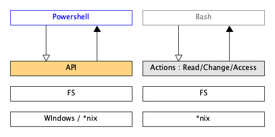

###### programming
# Powershell

**Powershell** is a powerful scripting language that can be used in any operating system.


<br>

## Why 




<br>

## Policies 

### Introduction 
As you can do any you want on a system using powershell, it is important to make sure your computer is protected from local or remote script execution. To prevent that to happen, you can define policies to restrict execution for your scripts.
There are : 

* Restricted : No script is allow to run 
* AllSigned : The script needs to be digitaly signed to run
* RemoteSigned : The remote script requires a trusted digital signature to run. But local scripts can run without any requirements.
* Unrestricted : It warns users when running remote scripts but won't block them 
* ByPpss: No restriction;
* Undefined

### Execution Scope

* LocalMachine 
* CurrentUser
* Process


<br>

## Basic Commands 

To list execution policies with their scope, use the following command: 

```powershell
$ Get-ExecutionPolicy -List

#         Scope ExecutionPolicy
#         ----- ---------------
# MachinePolicy    Unrestricted
#    UserPolicy    Unrestricted
#       Process    Unrestricted
#   CurrentUser    Unrestricted
#  LocalMachine    Unrestricted
```

### Pipes

`Out-File` Create a new file with the previous command output when you use a pipe (`|`)

```powershell
Get-Date | Out-File lol.txt
```

### Tests and Conditions

```powershell
If ( -Not (Test_path -Path ) ) 
{
  ...
}
```

<br>

## Pipelines

Powershell is a object-oriented solution that run on an object based environement.
A pipeline is somethimes used by adding a `|` between to tags.


For instance, the following command gets the name of the running processes

```powershell
$ pwsh> Get-Process | Select-Object -Property ProcessName
```


<br>

## Variables 

Variables start with `$` and store the contents in memory.

```powershell
$chromeProcesses = Get-Process -Name *Chrome*
```

<br>

## Loops


#### Do-While

```powershell
Do {
  $count = $count + 1 
  Write-Host "Count = $count"
} While ($count > 10 )
```

#### ForEach

```powershell
$colors = "blue", "red" ,"green", "yellow"

foreach ($color in $colors) {
  Write-Host "Color: $color"
}s
```


<br>

## Files

### Read 

```powershell
Cat <FilePath>
```

### Write

Example : 

```powershell
GetProcess | Out-File -FilePath <path/to/file>
```


<br>

## Functions


<br>

## Profiles

In power shell, we can use profile to auto load our helper functions.
The default profile file is located in the `$profile` variable.


<br>

## Modules & Snap-ins

### Module

A **Module** is a unit that brings additional functionnalities to your powershell scripts.
It is consist of : 

* Code
* A mnifest file
* Anything else need by youe code : assembly
* A Directory contains everything listed above and located wher pwsh can find it


Use the following command command to import a module

```powershell
Install-Package -Name <pkg>     [-Source]
Install-Module  -Name <module>  [-Source]
```

> Use `Find-Module -Name <MATCH>` to look for a module.

<br>

## Advanced stuffs

### Environment varaibles

#### List all en vars 

```powershell
Get-Childitem env:
```

#### Create a new env var 

```powershell
$env:NAME = VALUE
# or 
Set-Item -Path env:PATH -Value($env:TEAMS + '/os/bin')
```


### Update Type data

You can add a permanent propoerty to an object using some sort of lambda function.

```powershell
Update-TypeData -TypeName <Object Type> -MemberName <New Property Name> -MemberType scriptproperty -Value <Lambda expr>
```

Example: 

Add a new property `isDST` to the object type `system.datetime`, with the computed value `$this.isDaylightSavingTime()` as `int`.

```powershell
Update-TypeData -TypeName system.datetime -MemberName isDST -MemberType scriptproperty -Value {$this.isDaylightSavingTime() -as [int]}
```


### Testing 

You can use [pester](https://github.com/pester/Pester) to test your powershell scripts.


<br>

## Error handling 

$r = 1


<br>

## References

* [Gist | Powershell script template](https://gist.github.com/9to5IT/d81802b28cfd10ab5d89)
* [ss64 | Env vars with Powershell](https://ss64.com/ps/syntax-env.html)
* [ | ](https://channel9.msdn.com/Series/advpowershell3/09)